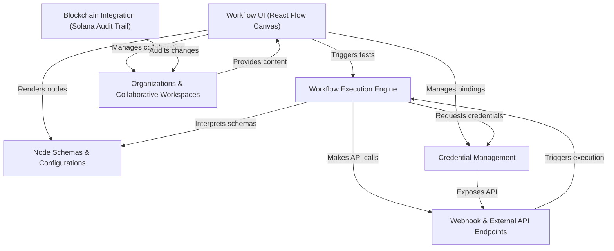
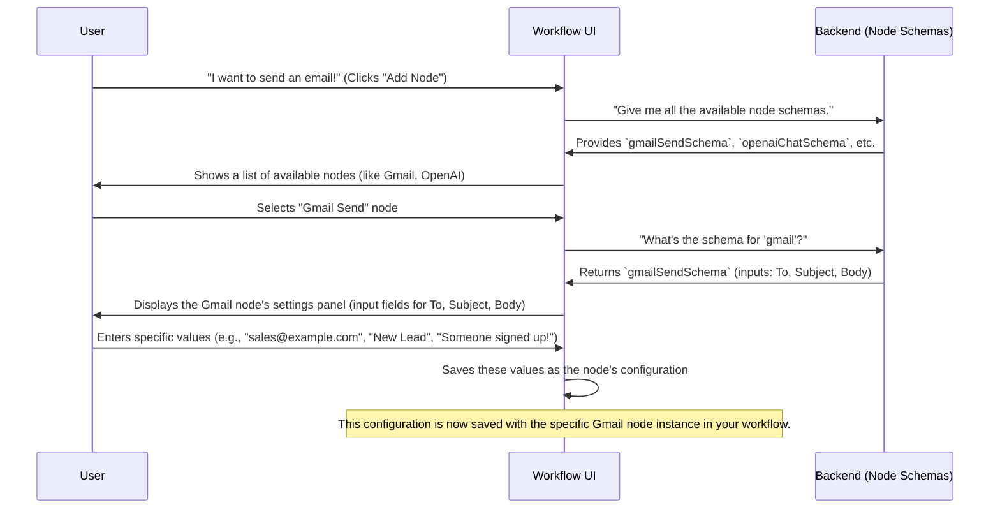
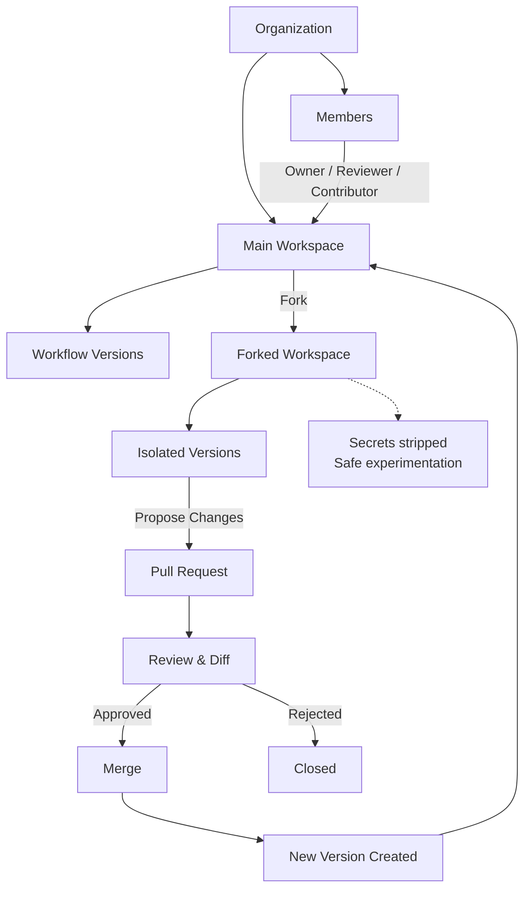
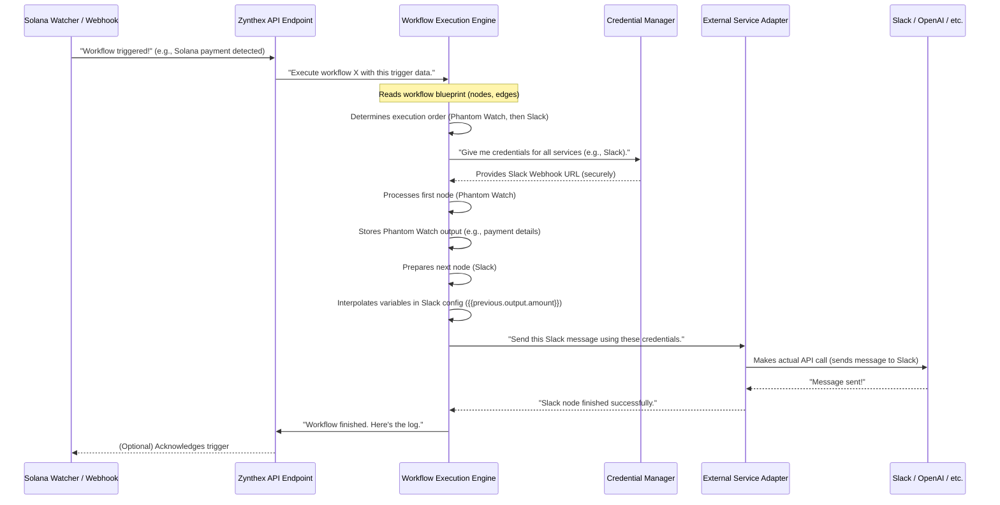
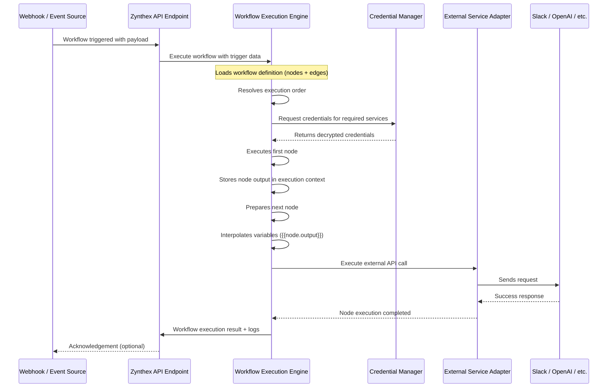
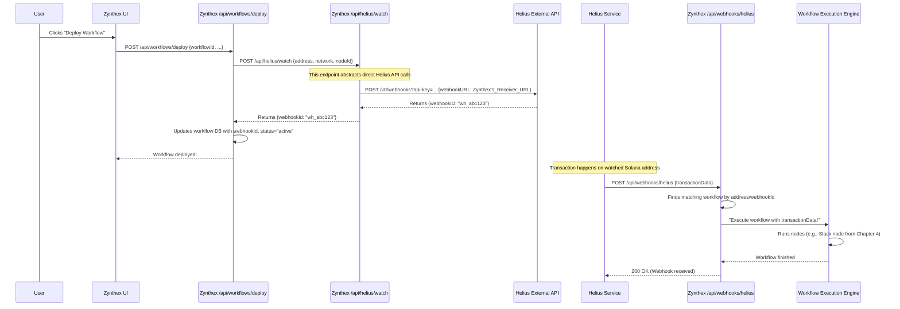
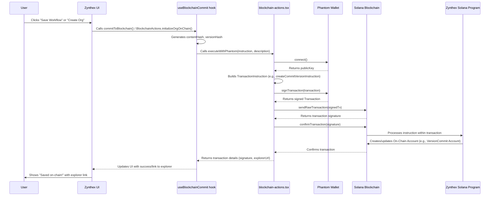

<div align="center">
  
</div>

Introduction
---

Zynthex is an **AI-powered automation platform for crypto payments**, designed for teams and businesses that need **reliable, verifiable, and auditable payment workflows**.

The platform enables users to build intelligent, multi-step automations around crypto transactions using a **visual workflow system**, seamlessly integrating wallets, blockchains, and external services. Zynthex securely manages credentials and applies AI-driven logic to process, validate, and route payment data in real time.

To ensure trust at scale, Zynthex leverages the **Solana blockchain** to create an **immutable audit trail** for critical activities—such as payment events, workflow executions, and collaborative changes. With **organization-based workspaces**, **version-controlled workflows**, and built-in governance, Zynthex allows teams to operate crypto payment automation with **full transparency, accountability, and confidence**.

Zynthex provides you the **ultimate platform for automating visual workflows for crypto payments** by using drag and drop/connect nodes on a canvas.

---

## Teck Stack

## Core Framework & Language

- **[Next.js](https://nextjs.org/)** – Full-stack React framework with App Router
- **[React 19](https://react.dev/)** – UI library
- **[TypeScript](https://www.typescriptlang.org/)** – Type-safe JavaScript

## Styling & UI

- **[Tailwind CSS](https://tailwindcss.com/)** – Utility-first CSS framework
- **[Radix UI](https://www.radix-ui.com/)** – Unstyled, accessible component primitives
- **[shadcn/ui](https://ui.shadcn.com/)** – Re-usable components built on Radix UI
- **[Lucide React](https://lucide.dev/)** – Icon library
- **[Motion](https://motion.dev/)** – Animation library (Framer Motion successor)
- **[GSAP](https://gsap.com/)** – Advanced animations
- **[React Fast Marquee](https://www.react-fast-marquee.com/)** – Smooth scrolling text

## Database & Backend

- **[Supabase](https://supabase.com/)** – PostgreSQL database with built-in auth and real-time subscriptions
- **[Drizzle ORM](https://orm.drizzle.team/)** – TypeScript ORM for database operations
- **[Upstash Redis](https://upstash.com/)** – Serverless Redis for caching and rate limiting

## Authentication

- **[Supabase Auth](https://supabase.com/auth)** – Email/password and OAuth authentication
- **Google OAuth** – Social login integration

## Workflow Engine

- **[@xyflow/react (React Flow)](https://reactflow.dev/)** – Visual workflow builder with drag-and-drop nodes
- **[Jotai](https://jotai.org/)** – Atomic state management for workflow data
- **[Zod](https://zod.dev/)** – Schema validation for node configurations

## Blockchain Integration

- **[Solana Web3.js](https://solana-labs.github.io/solana-web3.js/)** – Solana blockchain interaction
- **[@solana/wallet-adapter](https://github.com/solana-labs/wallet-adapter)** – Wallet connection for Phantom, Solflare, etc.
- **[Helius API](https://helius.dev/)** – Solana webhooks for real-time transaction monitoring
- **Alchemy** – Ethereum/Polygon webhooks for MetaMask wallet monitoring
- **Custom Solana Program** – Rust-based on-chain program for workflow execution

## AI & Machine Learning

- **[AI SDK (Vercel)](https://sdk.vercel.ai/)** – Unified interface for AI providers
- **[OpenAI](https://openai.com/)** – GPT-4 for natural language processing
- **[@ai-sdk/amazon-bedrock](https://aws.amazon.com/bedrock/)** – AWS AI models

## API Integrations (currnetly available Workflow Nodes)

| Category              | Node / Service Name     | Description                                                   |
|-----------------------|-------------------------|---------------------------------------------------------------|
| Communication         | Gmail API               | Send and receive emails using OAuth                           |
| Communication         | Email Node              | Generic SMTP-based email sending                              |
| Data Transformation  | HTTP Request Node       | Make REST API calls to any endpoint                           |
| Data Transformation  | Transform Node          | Execute JavaScript/TypeScript for data manipulation           |
| Data Transformation  | JSON/CSV Parser         | Parse and format JSON or CSV data                             |
| AI Processing        | OpenAI Node             | GPT-4 text generation and analysis                            |
| Blockchain / Crypto  | Phantom Wallet Node     | Monitor Solana wallet activity and transactions               |
| Blockchain / Crypto  | MetaMask Wallet Node    | Monitor Ethereum/Polygon wallet activity                      |
| Blockchain / Crypto  | Helius Webhook          | Real-time Solana transaction events                           |
| Blockchain / Crypto  | Alchemy Webhook         | Real-time Ethereum/Polygon transaction events                 |
| Google Workspace     | Google Sheets Node      | Read/write spreadsheet data using OAuth                       |
| Google Workspace     | Google Drive Node       | File operations using OAuth                                   |
| Flow Control         | Trigger Node            | Webhook-based workflow triggers                               |
| Flow Control         | Flow Node               | Conditional branching and looping logic                       |
| Flow Control         | Delay Node              | Scheduled or delayed execution                                |
| Payments             | Stripe                  | Payment processing and subscription billing                   |
| Payments             | CoinGate                | Cryptocurrency payment gateway                                |


---

*Built with modern web technologies for maximum performance and developer experience.*


## Visual Overview


---

# Node Schemas & Configurations

## Overview
Workflows are built from **nodes**, where each node represents a single action or trigger (wallet watch, payment, API call, email, database write, etc.).
The system separates **node definition** from **node usage** using **schemas** and **configurations**.


---

## Nodes
A **node** is one step in a workflow.  
Nodes can be triggers, actions, or utilities and are connected to form execution flows.

---

## Node Schemas
A **node schema** defines what a node *is capable of*.

It includes:
- Node identity (type, name, description)
- UI metadata (icon, color)
- Expected inputs
- Produced outputs
- Provider and operation details

Schemas are static and shared across all workflows.

---

## Node Configurations
A **node configuration** is a specific instance of a schema inside a workflow.

It includes:
- User-provided input values
- Input mappings from previous nodes
- Runtime parameters

Configurations are stored per workflow and can differ between nodes using the same schema.

---

## Inputs & Outputs
- **Inputs** define what data a node needs to execute.
- **Outputs** define what data a node produces for downstream nodes.

They enable data flow across the workflow graph.

---

## Execution Model
At runtime:
1. Node configuration is validated against its schema
2. The node operation is executed
3. Outputs are generated and passed forward

---

## Core Principles
- Schemas define **capabilities**
- Configurations define **behavior**
- UI is schema-driven
- Execution is configuration-driven

---

### Configurations: Your Node's Specific Settings

While a schema is the blueprint, a **Configuration** is *your specific instance* of that blueprint, filled with real values.

Using our "Gmail Send" node example:
*   The **schema** says it needs a `to` address, a `subject`, and a `body`.
*   Your **configuration** for a specific workflow might be:
    *   `to`: "john.doe@example.com"
    *   `subject`: "Your Order Confirmation"
    *   `body`: "Hello John, your order #123 has been placed!"

These configurations are what you enter into the UI when you set up a node in your workflow.

### How it Works Together: Sending a Gmail

Let's trace how schemas and configurations work when you want to set up a Gmail node:




Here, when you open the editor for a "gmail" node, the `NodeConfig` function acts like a switchboard, loading the `GmailConfig` UI component. This component then uses the `gmailSendSchema` (from `lib/engine/node-schemas.ts`) to dynamically create the input fields (`To`, `Subject`, `Body`) you see. When you type into these fields, the `onChange` function saves your input into the node's `data` (its configuration).


---

# Git Based Collaboration in Organizations

 An organization groups users who collaborate on shared workflows. It defines ownership, access control, and governance boundaries for all workflows inside it.
 
An organization in Zynthex groups users who collaborate on shared workflows.
It defines ownership, access control, and governance boundaries for all workflows inside it.
Zynthex enables Git-based workflow collaboration with optional, audit-grade cryptographic proofs.

Users can fork the main workflow into their own workspace without accessing the original creator’s credentials.
They make changes independently and submit a pull request back to the main workflow.
The workflow owner within the organization can review node-level changes and merge approved updates.
Optionally, workflow executions, commits, and merges are cryptographically tracked.

This creates a tamper-evident, audit-ready system suitable for healthcare, finance, and other high-data-sensitivity enterprises.

| Function         | Description    | 
|-----------------------|-------------------------|
| Roles | Members have roles such as owner, reviewer, or contributor. Roles determine who can invite users, create workspaces, review changes, and merge updates. |
| Workspaces | A workspace is a version-controlled container for workflows. It stores the workflow structure and maintains a full version history of every change. |
| Versions | Every save creates a new immutable version of the workflow. Older versions can be inspected or restored, ensuring traceability and rollback safety. |
| Forks | A fork is a personal copy of a workspace created for experimentation. Forks inherit the workflow structure but remove sensitive credentials by default. |
| Isolation | Forked workspaces are isolated from the main workflow, preventing unreviewed changes from affecting live automations. |
| Pull Requests | A pull request proposes merging changes from a fork into its parent workspace. It enables structured review, discussion, and approval before changes go live. |
| Diff & Review | Pull requests show exact differences between source and target workflows, including added, removed, or modified nodes and connections. |
| Merge Process | Approved pull requests create a new version in the target workspace, applying only reviewed changes and updating the current version pointer. |
| Security | Secrets and credentials are stripped from forks and revalidated on merge to prevent accidental exposure or misuse. |
| Auditability | All actions—organization changes, workspace updates, forks, reviews, and merges—are versioned and logged for full audit trails. |
| Collaboration Model | The system applies Git-style collaboration principles (fork, diff, review, merge) to workflow automation for safe team-based development. |




`Zynthex` enables teams to collaborate on powerful automations. **Organizations** for grouping users and defining roles, and **Workspaces** as version-controlled containers for workflows. The concepts of **forks** (personal copies for safe experimentation), **version history** (tracking every change), and **pull requests** (proposing changes for team review and integration) ensure that workflows are developed, reviewed, and deployed safely and efficiently, much like modern software development.

---

## Main Execution Engine

The **Workflow Execution Engine** is the core backend system responsible for executing workflows exactly as they are defined in the visual editor. It transforms a static workflow definition (nodes and edges) into a deterministic, runtime execution that interacts with real-world systems.

The engine is designed to be **deterministic**, **auditable**, **secure**, and **extensible**.

---

## Execution Responsibilities

| Area | Details |
|----|-------|
| Graph Interpretation | Reads workflow nodes and edges and treats them as a directed execution graph |
| Order Resolution | Computes a valid execution order based on node dependencies |
| Runtime Context | Maintains trigger input, node outputs, credentials, and metadata |
| Data Propagation | Passes structured outputs between connected nodes |
| Variable Resolution | Dynamically resolves variables at runtime |
| Credential Isolation | Loads and scopes credentials per provider |
| External Integration | Delegates service-specific logic to adapters |
| Execution Control | Enforces sequential execution and early termination on failure |
| Observability | Produces execution logs, node-level metadata, and audit trails |

---

## Trigger to Completion Flow

1. A workflow is triggered by an external event (webhook, blockchain event, schedule).
2. The API resolves the workflow definition and creates an execution record.
3. The execution engine is invoked with workflow content and trigger input.
4. The engine resolves execution order from the workflow graph.
5. Credentials required by the workflow are loaded securely.
6. Nodes are executed sequentially.
7. Outputs are stored and made available to downstream nodes.
8. Final output and execution metadata are persisted.

---

## Execution Context

During runtime, the engine maintains a shared execution context containing:

| Context Element | Purpose |
|---------------|--------|
| Trigger Input | Data that initiated the workflow |
| Node Outputs | Output of each executed node |
| Credentials | Secure credentials scoped per provider |
| Metadata | Timing, status, and execution diagnostics |

This context ensures deterministic data flow and reproducibility.

---

## Core Execution Loop (Essential Code)

```ts
export class WorkflowResolver {
  async execute(content, triggerInput) {
    const context = {
      triggerInput,
      nodeOutputs: new Map(),
      credentials: new Map(),
    };

    const executionOrder = this.buildExecutionOrder(content.nodes, content.edges);
    await this.loadWorkflowCredentials(executionOrder, context);

    for (const node of executionOrder) {
      const result = await this.executeNode(node, context);
      context.nodeOutputs.set(node.id, result);

      if (!result.success) {
        return { success: false, error: result.error };
      }
    }

    const lastNode = executionOrder.at(-1);
    return {
      success: true,
      output: context.nodeOutputs.get(lastNode.id)?.output,
    };
  }
}
```

### Under the Hood: The Engine's Conductor Role (for organizations)

Let's look at the sequence of events when your workflow is triggered.



This diagram shows that when a workflow is triggered (either by an external event like a Solana payment or a webhook), the Zynthex API hands it over to the Execution Engine. The engine then orchestrates the entire process: determining node order, securely getting credentials, filling in dynamic data, and using adapters to talk to external services.

### Under the Hood: How a Workflow Executes (Standard Mode)

This section explains how a workflow runs in **standard execution mode**, where the focus is on speed, reliability, and correctness — **without cryptographic proofs or on-chain verification**.

---

### Under the Hood: The Engine's Conductor Role (for normal workflows)

When a workflow is triggered (via a webhook, API call, or event watcher), the system hands control to the **Workflow Execution Engine**, which acts as the central orchestrator. It determines execution order, manages credentials, processes node outputs, and coordinates communication with external services.

---

## Execution Sequence



## Key Responsibilities of the Execution Engine

The Execution Engine is the core runtime component responsible for orchestrating workflow execution in standard mode. Its responsibilities are outlined below.

---

### 1. Workflow Resolution

- Reads the workflow blueprint, including nodes, edges, and configurations  
- Determines the correct execution order based on node dependencies  
- Ensures each node executes only after all prerequisite nodes have completed successfully  

---

### 2. Credential Management

- Requests credentials only at the moment they are required  
- Never exposes secrets to workflow authors, logs, or the execution context  
- Passes credentials securely to adapters at runtime  

---

### 3. Execution Context & State

- Maintains an in-memory execution context for the duration of the workflow  
- Stores outputs produced by each node  
- Makes previous node outputs available to downstream nodes via variable interpolation  

Example:
```txt
{{previous.output.amount}}
```


### 4. Adapter-Based Integrations

- Uses adapters as abstraction layers for external services
- Keeps the core execution engine decoupled from third-party APIs
- Enables new integrations to be added without modifying engine logic


### 5. Logging & Observability

- Records execution steps, timestamps, and node-level statuses
- Captures success and failure states for debugging and retries
- Returns structured execution logs to the API layer for UI display


In standard execution mode, logs are stored internally and are not cryptographically signed or anchored.
Standard execution mode is designed to prioritize simplicity and performance. It is optimized for:
- Fast iteration during development
- Everyday automation and integration workflows
- Internal and non-regulated use cases
- Low-latency execution requirements

Cryptographic verification and audit-grade guarantees are intentionally out of scope for this mode to keep the system lightweight and cost-efficient.

--- 

# Webhook & External API Endpoints


**Webhooks and API Endpoints** are the communication layer of `Zynthex`. They allow the system to **listen to external events**, **call external services**, and **expose internal control actions** in a structured and secure way.

This layer connects workflows to the outside world in real time.

---

## What Problem This Solves

| Need | Solution |
|----|---------|
| React to external events instantly | Webhook receivers |
| Register event listeners on external services | Outbound API calls |
| Deploy / undeploy workflows | Internal control APIs |
| Trigger workflows programmatically | Trigger endpoints |
| Decouple UI from integrations | Internal abstraction endpoints |

---

## Core Endpoint Types

| Endpoint Type | Purpose |
|-------------|--------|
| Webhook Receivers | Accept incoming event notifications |
| External API Calls | Register, update, or remove listeners |
| Internal APIs | Control workflows and system behavior |
| Trigger APIs | Start workflow execution programmatically |

---

## Webhook Receivers (Inbound)

Webhook receivers are **public-facing endpoints** that external services call when an event occurs.

| Property | Description |
|------|------------|
| Direction | External → Zynthex |
| Method | Usually POST |
| Purpose | Trigger workflows |
| Payload | Event-specific data |
| Security | Verified via provider rules or signatures |

Examples:
- Blockchain transaction notifications
- Payment confirmations
- Third-party service events

---

## External API Endpoints (Outbound)

These endpoints are used when Zynthex must **initiate an action** on an external service.

| Property | Description |
|------|------------|
| Direction | Zynthex → External |
| Usage | Create / delete webhooks, send data |
| Auth | Uses Credential Manager |
| Lifecycle | Called during deploy, execution, undeploy |

Examples:
- Register blockchain address watchers
- Send messages to Slack
- Call OpenAI APIs

---

## Internal API Endpoints

Internal endpoints coordinate system-level behavior and abstract complexity away from the UI.

| Endpoint Category | Responsibility |
|-----------------|----------------|
| Deployment APIs | Enable or disable workflows |
| Integration APIs | Manage provider-specific logic |
| Trigger APIs | Start workflow execution |
| Management APIs | Handle binding and state |

These endpoints are not tied to any specific provider and act as orchestration layers.

---

## Deployment Lifecycle

| Stage | Action |
|----|-------|
| Deploy | Register external listeners |
| Active | Receive webhooks and trigger workflows |
| Undeploy | Remove external listeners |
| Disabled | Ignore incoming events |

Each deploy operation may result in multiple outbound API calls depending on workflow nodes.

---

## End-to-End Event Flow

| Step | Description |
|----|-------------|
| 1 | Workflow is deployed |
| 2 | Zynthex registers listeners with external services |
| 3 | External event occurs |
| 4 | External service sends webhook to Zynthex |
| 5 | Zynthex identifies matching workflow |
| 6 | Workflow Execution Engine is invoked |
| 7 | Workflow completes execution |

---

## Workflow Triggering

Workflows can be triggered by:
- External webhooks
- Internal system events
- Manual API calls
- Scheduled triggers

All triggers funnel into the same execution engine for consistency.

---

## Safety & Guarantees

| Guarantee | Description |
|--------|------------|
| Stateless Receivers | Webhooks do not store secrets |
| Controlled Execution | Only deployed workflows can run |
| Credential Isolation | Secrets never exposed to endpoints |
| Idempotency | Duplicate events can be handled safely |
| Auditability | Every trigger is logged |

---

## Design Principles

- Event-driven architecture
- Clear separation of inbound vs outbound communication
- Provider abstraction via internal APIs
- Secure credential usage
- Deterministic execution

---




**Blockchain Integration** provides an immutable, verifiable audit layer for `Zanthex`.  
All critical lifecycle events are recorded on the **Solana blockchain**, ensuring that no actor—including administrators—can alter historical records.

This enables **regulatory-grade trust, compliance, and non-repudiation**.

---

## What Problem This Solves

| Risk | Mitigation |
|----|-----------|
| Workflow history tampering | Immutable on-chain records |
| Disputed authorship | Wallet-signed transactions |
| Unverifiable approvals | On-chain PR actions |
| Execution falsification | Execution hash anchoring |
| Centralized trust | Public blockchain verification |

---

## What Gets Recorded On-Chain

| Event | Purpose |
|----|--------|
| Organization creation | Proves ownership and origin |
| Workspace creation | Verifies project existence |
| Workflow version commit | Immutable version fingerprint |
| Pull request creation | Records proposed changes |
| PR approval | Records reviewer consent |
| PR merge | Records final acceptance |
| Workflow execution | Verifies runtime integrity |

---

## Core Concepts

| Concept | Description |
|------|------------|
| Audit Trail | Chronological, verifiable event history |
| Immutability | On-chain data cannot be altered |
| Hashing | Workflow content fingerprinting |
| Transactions | Signed proof of user intent |
| PDAs | Deterministic on-chain accounts |
| Dual Storage | Full data off-chain, proof on-chain |

---

## Hash-Based Verification Model

Only **hashes** are written on-chain.

| Hash | Represents |
|----|-----------|
| Content Hash | Exact workflow structure |
| Version Hash | Unique workflow version |
| PR Hash | Source + target workflow state |
| Execution Hash | Runtime result fingerprint |

Any mismatch between off-chain data and on-chain hash indicates tampering.

---

## On-Chain Commit Flow

1. Workflow change occurs
2. Content hash is generated
3. User signs Solana transaction
4. Instruction is sent to Solana program
5. PDA account is created or updated
6. Transaction is confirmed and immutable

---

## User Authorization Model

| Action | Authorization |
|-----|--------------|
| Record event | Wallet signature required |
| Approve PR | Reviewer wallet |
| Merge PR | Authorized wallet |
| Execute workflow | Executor wallet |

Every on-chain record is **cryptographically linked** to a real signer.

---

## Solana Program Responsibilities

| Responsibility | Description |
|--------------|-------------|
| Instruction validation | Enforces correct state transitions |
| PDA derivation | Ensures deterministic accounts |
| State creation | Stores audit metadata |
| Ownership enforcement | Validates signers |
| Timestamping | On-chain event time |

---

## Execution Proofs

Workflow executions can also be anchored:

| Data | Purpose |
|----|--------|
| Version hash | Which workflow ran |
| Result hash | What outcome occurred |
| Execution ID | Runtime correlation |

This enables provable execution integrity without leaking sensitive data.

---

## Security & Compliance Guarantees

| Guarantee | Achieved By |
|--------|------------|
| Non-repudiation | Wallet signatures |
| Tamper resistance | Blockchain immutability |
| Verifiable history | Public ledger |
| Minimal exposure | Hash-only storage |
| Cost efficiency | Solana low fees |

---



