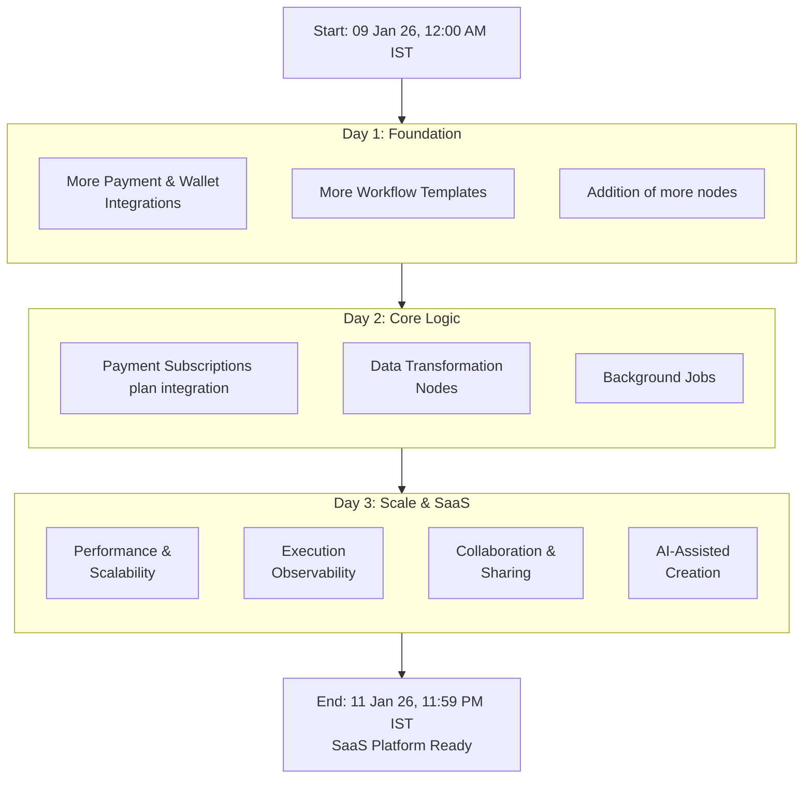
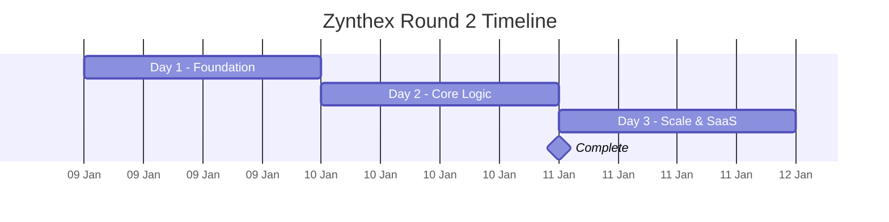

# Roadmap & Planned Improvements (Round 2)

This document outlines the **features, improvements, and technical upgrades** planned for **Round 2** of Zynthex, based on current progress, feedback, and real-world usage requirements.

Round 2 is focused on evolving Zynthex from a **hackathon MVP** into a **complete, SaaS-grade product with end-to-end development**, covering reliability, usability, security, and scalability.

---

## 1. More Payment & Wallet Integrations

### Planned Improvements
- Support for additional crypto payment gateways (e.g. Coinbase Commerce, NOWPayments)
- Expanded wallet listeners across EVM chains and Solana mainnet
- A unified “Payment Trigger” abstraction node

### Goal
Reduce integration friction and make payments feel native inside workflows.

---

## 2. Workflow Templates (High Impact)

### Planned Improvements
- Pre-built templates for common real-world use cases:
  - Payment → Email receipt
  - Payment → Google Sheet entry
  - Payment → Database record
  - Payment → Slack / Discord notification
- One-click deployment of templates

### Goal
Minimize onboarding time and allow non-technical users to start instantly.

---

## 3. Improved Non-Coder Experience

### Planned Improvements
- Clearer node descriptions with examples
- Inline validation and setup guidance
- Smart variable suggestions and auto-mapping
- Guided “first workflow” experience

### Goal
Make Zynthex fully usable by non-developers without sacrificing power.

---

## 4. Better Error Handling & Retries

### Planned Improvements
- Automatic retries for transient failures
- Configurable retry strategies
- Clear failure diagnostics per node
- Partial execution visibility

### Goal
Increase reliability and trust in production workflows.

---

## 5. Conditional Logic & Branching

### Planned Improvements
- If / Else nodes
- Amount-based and data-based conditions
- Visual branching paths

### Goal
Enable real business logic without custom code.

---

## 6. Data Transformation & Utility Nodes

### Planned Improvements
- Data formatting and mapping nodes
- JSON parsing and validation
- Math and string operations
- Delay and scheduling utilities

### Goal
Reduce manual data handling and workaround logic.

---

## 7. Database & Storage Enhancements

### Planned Improvements
- Full read/write Postgres integration
- Schema-aware field mapping
- Query templates and previews

### Goal
Support production-grade data pipelines.

---

## 8. Execution Reliability & Observability

### Planned Improvements
- Visual execution timelines
- Per-node execution metrics
- Input/output inspection tools
- Execution replay for debugging

### Goal
Provide full transparency into workflow behavior.

---

## 9. Collaboration & Sharing Improvements

### Planned Improvements
- Read-only workflow sharing
- Template export/import
- Environment separation (dev / staging / prod)

### Goal
Support team workflows and safe iteration.

---

## 10. Performance & Scalability

### Planned Improvements
- Background job queues
- Rate limiting per workflow
- Faster cold-start execution
- Parallel execution for independent nodes

### Goal
Ensure Zynthex scales reliably as usage grows.

---

## 11. AI-Assisted Workflow Creation

### Planned Improvements
- Natural language → workflow draft
- AI-suggested next steps
- Auto-generated email and message drafts

### Goal
Reduce setup time while keeping users in control.

---

## 12. End-to-End SaaS Productization

### Planned Improvements
- Fully hosted, production-ready infrastructure
- Authentication, billing, and usage tracking
- Clear upgrade paths between plans
- Operational monitoring and alerts
- Long-term maintainability and support readiness

### Goal
Transform Zynthex into a **complete SaaS platform**, not just an automation engine.

---

## Summary

Round 2 is about turning Zynthex into a **fully usable, SaaS-grade automation product** with:
- End-to-end development
- Production reliability
- Non-coder accessibility
- Real-world payment workflows

This phase bridges the gap between **hackathon prototype** and **real-world SaaS adoption**.

---

---

---

**Zynthex — From payment events to production-ready automation.**
