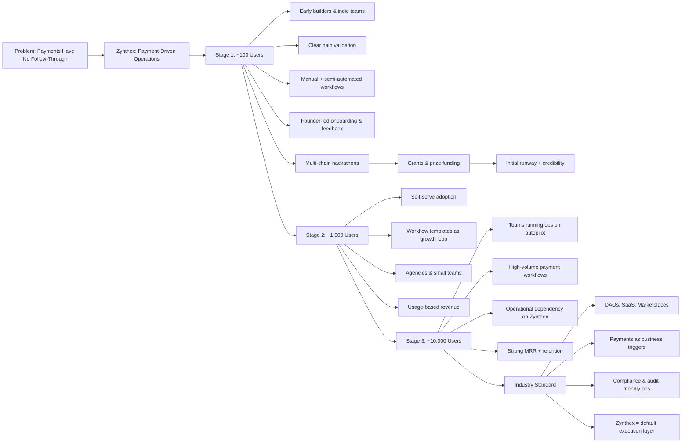
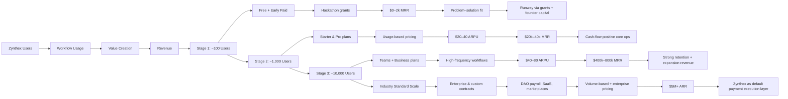

# Zynthex  
**AI Automations for Crypto Payments**

---

## 1. Vision

## What Zynthex Is

# Zynthex

Zynthex is a **next-generation SaaS automation platform for crypto payments**, built to become the missing execution layer of the crypto economy.

Zynthex lets users connect **crypto wallets, payment gateways, and APIs** and automate *everything that happens after a payment*. From the moment funds hit a wallet, Zynthex can trigger intelligent, multi-step workflows—automatically generating invoices, updating databases, managing leads, sending emails, syncing documents, enforcing access control, and much more.

At its core, Zynthex is a **node-based, no-code automation engine** designed to be powerful yet deeply intuitive. Users simply plug in a wallet address, connect services like Gmail, Docs, Sheets, databases, CRMs, or custom APIs, deploy the workflow, and **watch real-world and on-chain events drive their business automatically**—without writing a single line of code.

## Overall Diagramatic overview.

Zynthex is built for **scale and versatility**. It serves everyone from individual freelancers and crypto traders to Web3 agencies and large enterprises—such as NFT marketplaces accepting multi-chain payments, DAOs managing contributor payouts, and businesses operating across **Solana, Polygon, and Ethereum**. Whether you're handling one payment a day or millions in transaction volume, Zynthex adapts effortlessly.
What truly sets Zynthex apart is its **unmatched simplicity combined with enterprise-grade power**. No existing platform offers this level of ease while supporting crypto-native workflows, deep integrations, and real-time automation. Zynthex doesn’t just connect tools—it **turns crypto payments into fully automated business operations**.

Zynthex is not just another automation tool.  
It is the **operating system for crypto-powered businesses**.

**If money moves, Zynthex reacts.**

Zynthex works like **n8n-style nodes in a 2D visual interface**, where users build workflows by connecting blocks instead of writing code. Each block represents a real action—listening to a wallet, sending an email, updating a spreadsheet, querying a database, or calling an API.

It is:
- **Hosted** (no self-hosting, no servers)
- **Low-code / no-code**
- **Usable by non-developers**
- **Powerful enough for developers**

---

### Some previous research on crypto payment markets:

https://www.credenceresearch.com/report/crypto-payment-gateways-market

https://www.fortunebusinessinsights.com/industry-reports/blockchain-market-100072

https://www.polarismarketresearch.com/industry-analysis/cryptocurrency-payment-solutions-market

https://www.globalinsightservices.com/reports/bitcoin-payment-ecosystem-market/

https://www.globalinsightservices.com/reports/bitcoin-payment-ecosystem-market/

---

## Why People Actually Use It (Daily Use)

Zynthex reduces the need to write and maintain glue code.

Instead of:
- Writing scripts for webhooks
- Managing cron jobs
- Handling retries and failures
- Wiring APIs together manually

Users visually define workflows like:
- *Wallet receives payment → verify amount → fetch user data → send custom email*
- *Crypto payment confirmed → store record in Google Sheets / Postgres*
- *Payment event → generate message using AI → notify Slack*

This makes Zynthex useful for **everyday business operations**, not just demos or experiments.

---

## Who It’s For

- **Non-coders** who want automation without writing code  
- **Developers** who want to reduce boilerplate and infra work  
- **Teams** who need a hosted, reliable automation system  
- **Businesses** accepting crypto or online payments  

Zynthex replaces dozens of small scripts with a **single visual workflow**.

---

## Key Value Proposition

- Visual, node-based automation (n8n-like)
- Crypto & payment-native triggers
- Works with familiar tools (Gmail, Sheets, DBs, APIs)
- Reduces code, maintenance, and operational complexity
- Fully hosted SaaS—ready to use

---

**Zynthex turns payments into actions, without code.**

---

## 2. The Problem

Crypto payments are easy to receive, but hard to **operate**.

Today, when a crypto or online payment happens:
- Teams manually verify transactions
- Copy data into Google Sheets or databases
- Send confirmation emails or Slack messages
- Trigger internal workflows by hand

This is slow, error-prone, and doesn’t scale.

Traditional automation tools:
- Don’t understand wallets or crypto events
- Require heavy custom scripting
- Break when workflows become complex

---

## 3. The Solution

**Zynthex connects payments to actions.**

Users can:
- Connect wallet addresses or payment providers
- Listen for incoming payments or events
- Automatically trigger workflows across tools

No scripts. No cron jobs. No glue code.

---

## 4. What You Can Do With Zynthex (Daily Use Cases)

### Payments → Operations
- Wallet receives funds → send confirmation email
- Payment confirmed → update Google Sheet
- Transaction detected → create database record
- Refund processed → notify Slack / Discord

### Payments → Business Logic
- Check payment amount → apply conditional logic
- Match transaction → fetch user data from Airtable/Postgres
- Generate custom email content
- Trigger internal tools or APIs

### Payments → Analytics & Tracking
- Store transaction metadata in Sheets or DB
- Sync data to dashboards
- Create automated reports

---

## 5. How It Works (High Level)

1. User connects:
   - Wallet address OR payment gateway
   - External tools (Gmail, Sheets, DBs, APIs)

2. User builds a workflow:
   - Trigger: payment or webhook
   - Actions: email, DB write, API call, AI generation

3. Zynthex handles:
   - Execution
   - Credentials
   - Data flow
   - Reliability

---

## 6. Core Features

| Feature | Description |
|------|------------|
| Wallet Triggers | Listen to on-chain wallet activity |
| Payment Webhooks | Connect gateways and payment URLs |
| Visual Workflow Builder | Node-based automation editor |
| Tool Integrations | Gmail, Sheets, DBs, APIs |
| AI Nodes | Generate emails, messages, summaries |
| Data Mapping | Use outputs across steps |
| SaaS Hosting | No self-hosting required |

---

## 7. Why This Is Different

Zynthex is **not a generic automation tool**.

It is:
- Payment-first
- Crypto-aware
- Designed for real business workflows
- Built for non-blockchain-native teams

This makes it usable for:
- Web3 startups
- SaaS companies accepting crypto
- Freelancers and agencies
- Finance and ops teams

---

## 8. Target Users

### Early Users
- Crypto startups
- Indie SaaS builders
- Freelancers accepting crypto
- Web3 agencies

### Long-Term Users
- Fintech platforms
- Marketplaces
- Subscription services
- Payment processors

---

## 9. Business Model (SaaS)

### Pricing (Indicative)

| Plan | Price | Target |
|----|------|-------|
| Free | $0 | Demos & trials |
| Starter | $29–49/mo | Individuals |
| Pro | $99–199/mo | Teams |
| Business | $299+/mo | Companies |

Pricing scales by:
- Workflow runs
- Connected accounts
- Advanced integrations

---

## 10. Market Scope

- Crypto payments adoption is increasing but there are no automation tools that can connect just by  wallet  address and can trigger your nodes .
- Zynthax is the trader’s edge — track fund flows, follow big players, and act before the market does.
- Turn their on-chain activity into data-backed trading decisions.
- **From whale wallets to your next trade Zynthax connects the dots.**
- If your **DAO** still tracks salaries manually, it’s already outdated. Zynthax brings payroll, records, and communication into one flow.

Zynthex sits at the intersection of:
- Payments
- Automation
- AI
- SaaS operations
- Informed Crypto Trading Decisions

---

## 11. Why Now

- Crypto payments are becoming mainstream
- Teams want fewer custom scripts
- No transparent and loggable workflows available in market for crypto transactions.
- No dominant “Zapier for crypto payments” exists
- Crypto activity is moving faster than human workflows.
- Zynthax as it provide immutable logs and commit history of workflows for crypto transactions.

---

